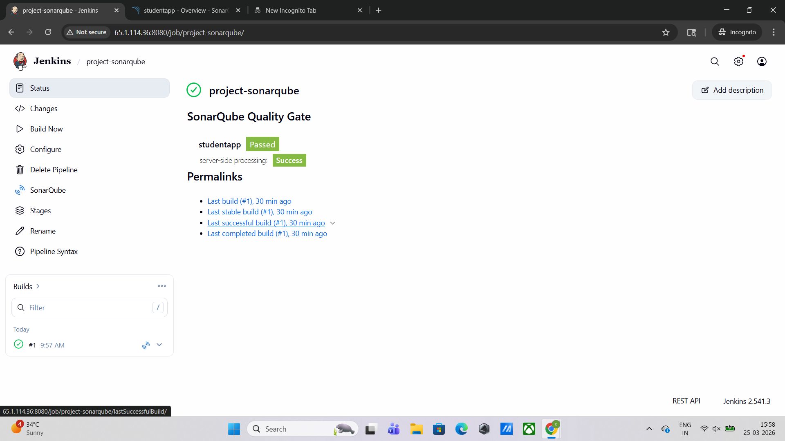
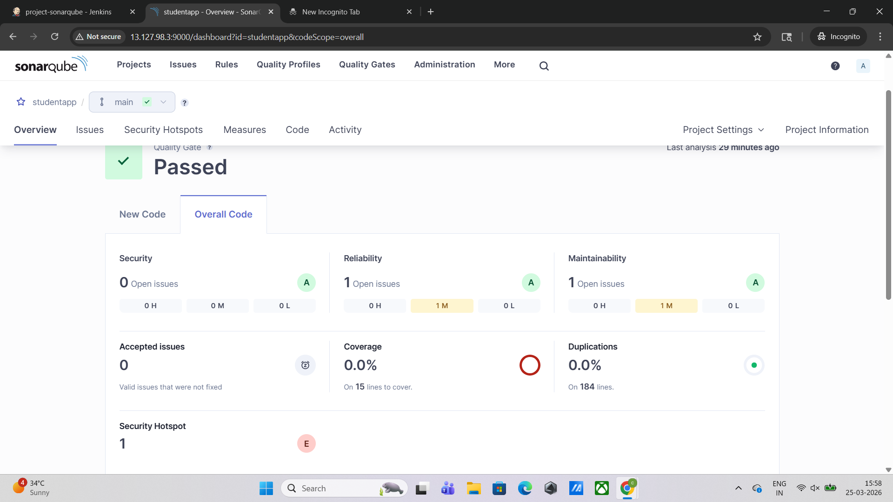

# 🚀 End-to-End DevOps CI/CD Pipeline with Jenkins & SonarQube

## 📌 Project Overview

This project demonstrates a **production-style DevOps pipeline** for a full-stack application with integrated **code quality analysis using SonarQube**.

The pipeline ensures that every code change is:

* Automatically built
* Analyzed for quality & security
* Validated using Quality Gates before deployment

---

## 🎯 Problem Statement

In real-world development, poor code quality and lack of automation lead to:

* Production bugs
* Security vulnerabilities
* Inconsistent deployments

This project solves that by implementing:
✔ Automated CI pipeline
✔ Code quality enforcement
✔ Scalable cloud-based setup

---

## 🏗️ Architecture Overview

```text
Developer → GitHub → Jenkins → Build → SonarQube Analysis → Quality Gate → Ready for Deployment
```

---

## 🛠️ Tech Stack

| Category     | Tools                 |
| ------------ | --------------------- |
| Frontend     | React (Vite)          |
| Backend      | Spring Boot (Java 17) |
| Database     | AWS RDS (MariaDB)     |
| CI/CD        | Jenkins               |
| Code Quality | SonarQube             |
| Cloud        | AWS EC2               |
| Build Tool   | Maven                 |

---

## 📂 Project Structure

```text
devops-jenkins-sonarqube-project/
│
├── backend/         # Spring Boot application
├── frontend/        # React application
├── Jenkinsfile      # CI/CD pipeline
├── README.md
├── .gitignore
```

---

## ⚙️ CI/CD Pipeline Stages

### 🔹 1. Source Code Checkout

* Pulls latest code from GitHub

### 🔹 2. Build Stage

* Compiles backend using Maven
* Generates `.jar` artifact

### 🔹 3. SonarQube Analysis

* Scans code for:

  * Bugs
  * Vulnerabilities
  * Code Smells
  * Security issues

### 🔹 4. Quality Gate Check

* Pipeline waits for SonarQube result
* Ensures code meets defined quality standards

---

## 🔍 Jenkins Pipeline

```groovy
pipeline {
    agent any

    stages {
        stage('pull') {
            steps {
                git branch: 'main', url: 'https://github.com/Chandangadewar/devops-jenkins-sonarqube-project.git'
            }
        }

        stage('build') {
            steps {
                sh '''
                    export JAVA_HOME=/usr/lib/jvm/java-17-openjdk-amd64
                    export PATH=$JAVA_HOME/bin:$PATH
                    cd backend
                    mvn clean package -DskipTests
                '''
            }
        }

        stage('sonar-scan') {
            steps {
                withSonarQubeEnv('Sonar-env') {
                    sh '''
                        cd backend
                        mvn sonar:sonar \
                        -Dsonar.projectKey=studentapp \
                        -Dsonar.projectName=studentapp
                    '''
                }
            }
        }

        stage('Quality Gate') {
            steps {
                timeout(time: 10, unit: 'MINUTES') {
                    waitForQualityGate abortPipeline: false
                }
            }
        }
    }
}
```

---

## 🔐 SonarQube Integration

### ✔ Features

* Static code analysis
* Security vulnerability detection
* Maintainability scoring
* Code duplication detection

### ✔ Quality Gate

* Pipeline is validated against quality rules
* Ensures production-ready code

---

## 🌐 Application Deployment

### Frontend

* Built using React (Vite)
* Deployable on Apache/Nginx

### Backend

* Spring Boot application
* Runs on EC2 (Port 8081)

### Database

* AWS RDS (MariaDB)

---

## 🛠️ Setup Guide

### 🔹 Jenkins Setup

```bash
sudo apt update
sudo apt install -y openjdk-17-jdk maven git
```

### 🔹 SonarQube Setup (Docker)

```bash
sudo apt install docker.io -y
sudo docker run -d -p 9000:9000 sonarqube:10.6-community
```

---

## 🔑 Jenkins Configuration

* Install plugin: **SonarQube Scanner for Jenkins**
* Add credential:

  * Kind: Secret Text
  * ID: sonar-token
* Configure Sonar server:

  * Name: Sonar-env
  * URL: http://<sonarqube-ip>:9000

---

## 📊 Results

* Successful pipeline execution ✔
* SonarQube analysis completed ✔
* Quality Gate status: PASSED ✔

---

## 🎯 Key Learnings

* CI/CD pipeline creation using Jenkins
* Integrating SonarQube for code quality
* Managing credentials securely
* Debugging real DevOps issues
* Designing production-like workflows

---

## 🚀 Future Enhancements

* Add Docker build stage
* Deploy using Kubernetes
* Integrate monitoring (Prometheus/Grafana)
* Automate deployment after Quality Gate


## 📸 Screenshots

### Jenkins Pipeline


### SonarQube Dashboard


---

## 👨‍💻 Author

**Chandan Gadewar**
